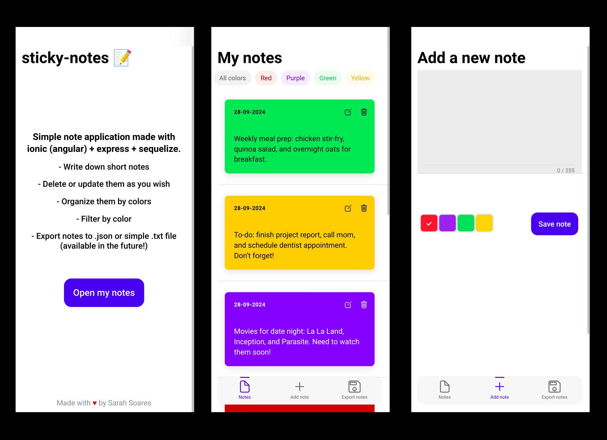

# Sticky Notes App

This application allows you to write and manage short notes easily. You can organize them by four different colors and filter notes by color. You can also update or delete notes as needed. This project was created for the Server-side Development course at IES El Rincón and is built with Angular, Node.js, MySQL, and Sequelize.



### Prerequisites:

Google Chrome or any other browser installed. VSCode, MySQL Server, MySQL Workbench and node.js installed.


### Endpoints:

https://documenter.getpostman.com/view/37801455/2sAXxJhEy2 

### Instructions:

1. ```
   git clone https://github.com/scsoares/sticky-notes-app
   ```

   or download this repo as a [ZIP file](https://github.com/scsoares/sticky-notes-app/archive/master.zip).

2. Unzip the file and you should have a folder named `sticky-notes-app-master`.

3. In order to open the website, open the `sticky-notes-app-master` folder on VSCode and run in the terminal:

```
cd backend
npm install

```

then:

```
cd ../frontend
npm install
```

and you will have your dependencies installed.

4. Add your mySQL root password in db.config.js.

5. Then, run the following commands.

Make sure you are in the backend folder again:

```
node index.js

```

Now, in the frontend folder:

```
ionic serve

```

6. Then, open the localhost that ionic will present to you.

## Built With

`angular` `ionic` `node.js` `sequelize`

## Authors

- **Sarah Soares** - _Initial work_ - [scsoares](https://github.com/scsoares)
